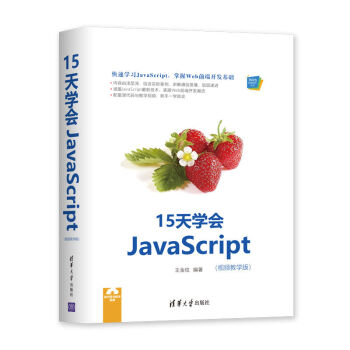
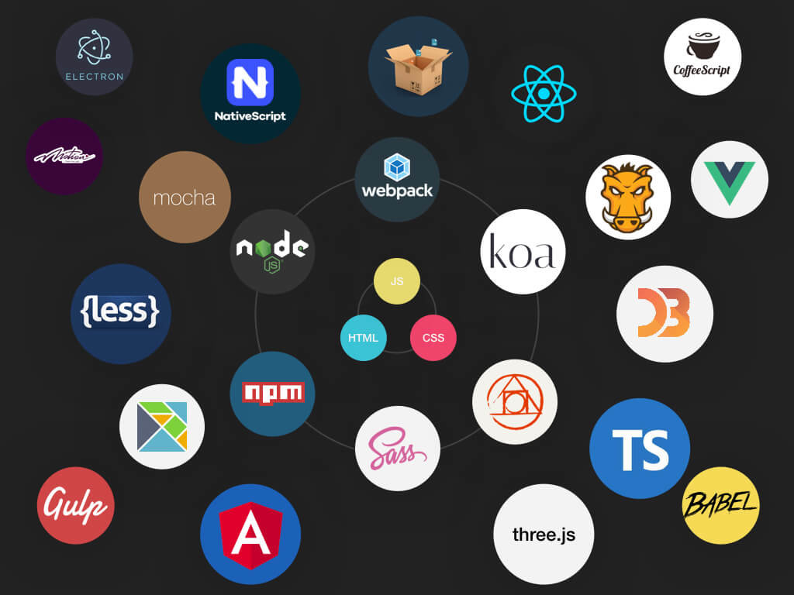
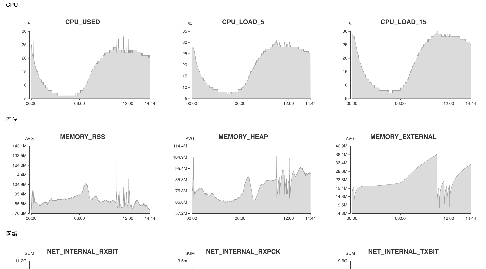
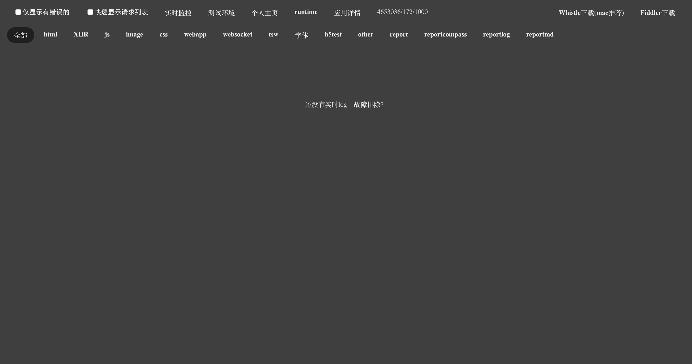

<!-- background: index-background -->

# 前端开发现状

---

> 应赵楠的邀请，简要阐述一下前端开发现貌
> 
> 以下均为个人见解，如有不妥，欢迎指出

---

## 两个误区

 

- 前端以为后端是CRUD
- 后端以为前端是切图仔

--- 

## 先来简述下前端历史

 

> 节选自 [前端开发的历史和趋势](https://github.com/ruanyf/jstraining/blob/master/docs/history.md)

--- 

## 早期

 

- 前后端开发是一体的，主要采用后端MVC模式
- 彼时的"前端"负责的是View层的页面模板拼接

---

## Ajax

 

- Ajax技术诞生，使前后端分离成为可能
- 前端不再是后端的模板，可以独立获得各种数据
- 典型应用：Gmail（2004）Google Maps（2005）

--- 

## Web 2.0

 

- Ajax技术促成了 Web 2.0 的诞生
- Web 1.0：静态网页，纯内容展示
- Web 2.0：动态网页，富交互，前端数据处理

--- 

## Node

 

- 2009年，Node项目诞生，它是服务器上的 JavaScript 运行环境。
- Node = JavaScript + 操作系统 API
- npm加速了前端工程化，社区化

---

## 再来看下开头的那个误区

 

前端很难吗？

---

不难，一周左右学会HTML + CSS，两周学会JavaScript

 

仅仅是个吐槽:)

--- 

## 前端的难点在什么？

 

- 一部分是语言的原因
- 一部分是工程的原因

---

## 语言方面

 

- JavaScript本身过于随意，语法本身就有不少坑
- 动态语言，大型项目乏力？

 

## 工程方面

 

- 在node和npm之前，没有统一的工程化、模块化的规范

 

为何流行：V8太给力(Google在前端的分量）

---

## 语言不够，社区来凑

 

值得一提的是JavaScript社区很活跃，弥补了不少语言本身的缺陷

--- 

## 常见的社区方案

 

- 强类型：typescript（静态类型，语法糖）
- 打包工具：webpack（模块化，代码压缩混淆）
- 预编译器： prepack（提高代码执行速度）
- 代码规范： eslint（避免js本身的一些坑）、stylelint
- 代码转换： babel（浏览器新语法跟进慢）

 

特点：前端的学习少在语言层面，多在社区层面

PS：几乎所有工具都是开源的

---

---

## 上述工具解决了什么问题？

 

写一个页面容易，写一百个，一千个呢？

一旦规模变大，会写与能写的区别就凸显了

---

## 再讲一下node，前端能用node来干嘛？

---

node端表面上看是能让js写服务端

 

但node带来的变革不止如此

---

## 外面在用node干什么？

 

- 真的服务端，参见egg、hapi之类的框架
- 前后端同构，引入服务端渲染，意义？
- 运维、监控、抓包，参见TSW
- 国内node实践较早的两家公司：阿里，腾讯

---

---

---

## 所以前后端的区别是什么？

 

我认为前后端已经不是单纯那种运行在服务端还是客户端的区别

当然也和用什么语言没关系，不同领域的语言和工具都可以共用

我更倾向于用数据来区分二者:)

 

- 前端是获取数据，展示数据（手段不限于在客户端拼接还是在服务端拼接）
- 后端是处理，存储，分析数据

---

## 8012年的今天，前端正在流行什么？经历什么？

 

- 三大MVVM鼎立：Augular，React，Vue
- 运行环境的多样化：浏览器, node，electron, 小程序，快应用
- PWA兴起
- 多端框架的流行：RN，Taro，mpvue
- WebAssembly

---

## 框架解决的问题

 

- 可复用性，可维护性，组件化
- 引入visual DOM，减少频繁的DOM操作带来的性能消耗
- 生成平台无关的数据结构描述，方便多端实现

--- 

## 未来

 

- 拥抱规范，Web Components, css next, Houdini, Shadow DOM
- 每一项技术变革都可能带来前端巨变，三大框架的未来？
- PWA，多端实现的最低成本
- WebAssembly，为前端引入新的血液

---

# Thanks
